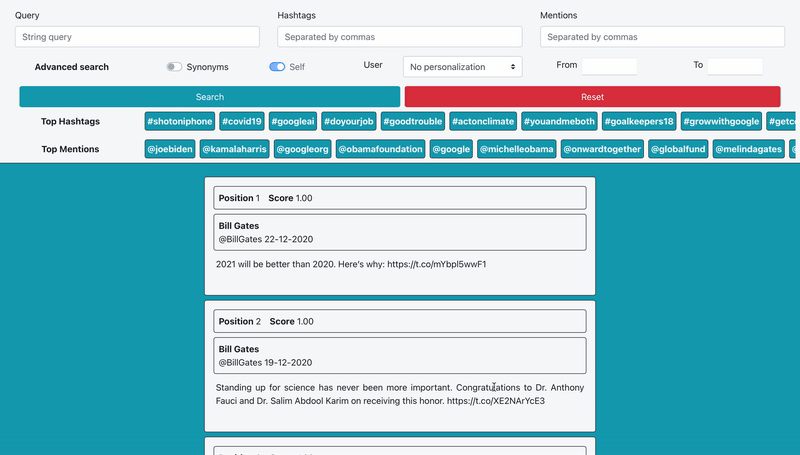

# Personalized Search Engine for microblog

The aim of this project is to design and build a search engine for a micro-blog, whose content is based on tweets published by a set of users. The implemented 
system allows the user to perform a simple or advanced search and it offers the possibility to rank the results according to his interests. The database and the 
search engine were based on the bonsai.io platform, which offers a free Elasticsearch installation deployed on the cloud. The crawler used to collect data from 
Twitter and the search framework were built entirely on Java using the Java REST Client (High Level) for Elasticsearch and the Twitter4J library. Finally, the 
user interface is provided through a simple web-app developed using the Spring and Thymeleaf frameworks. 

## Authors
* Lorenzo Pirola &nbsp;
 &nbsp;
 &nbsp;

## Demo

